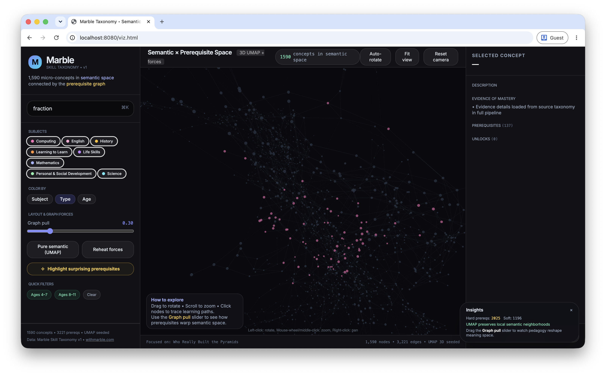

# Embeddings & Spatial Visualization

**Reproducible semantic embeddings + hybrid graph visualization for the Marble Skill Taxonomy.**

This contribution adds a fully Dockerized pipeline that turns the hand-authored prerequisite graph into an explorable 3D semantic space while keeping the graph structure visible and interactive.

## Why this exists

The original release deliberately excluded semantic embeddings because they are *derived* and recomputable. This package gives you a clean, versioned, deterministic way to generate them.

The visualization lets you see two complementary structures at once:

- **Semantic diversity** (UMAP projection of embeddings) — concepts that *feel* similar sit close together in space.
- **The prerequisite web** (directed edges) — the actual pedagogical dependencies a learner must traverse.

By allowing you to dial graph forces on top of the semantic layout, you can literally watch how the declared learning structure sits inside (or stretches across) conceptual neighborhoods.

This often reveals **surprising long-range connections** — hard prerequisites between ideas that are distant in meaning space.

## Quick start (recommended)

```bash
# From the repository root
./scripts/generate-viz.sh
```

This builds the Docker image (if needed), runs the full pipeline, and prints instructions.

After success:

```bash
cd generated
python -m http.server 8080
# Then open http://localhost:8080/viz.html
```

On macOS:

```bash
open generated/viz.html
```

## What you get

- `generated/topics_with_layout.json` — every topic with stable 3D + 2D UMAP coordinates
- `generated/links.json` — the prerequisite graph (strength + reason)
- `generated/chroma/` — a queryable Chroma vector database with rich metadata
- `generated/generation_manifest.json` — full provenance (model, params, timestamp, text strategy)
- `generated/viz.html` — the interactive explorer (copied from the source template in embeddings/)

Here's what it looks like:



## The visualization features (highlights)

- **3D force-graph** (WebGL) seeded with UMAP positions
- Live **Graph pull** slider — morphs between pure semantic layout and graph-respecting layout
- Click any node → traces full prerequisite ancestor chains (warm/orange) + what it unlocks (green) with animated particles traveling the edges
- **"Highlight surprising prerequisites"** — surfaces hard edges between semantically distant concepts
- Search, subject filters, age quick-filters, multiple color modes
- Rich inspector panel with direct navigation
- Camera controls, auto-rotate, fit view, reset
- Fast (1,590 nodes is small) and uses fixed random seeds for reproducibility

## Architecture & reproducibility

**Embedding model** (default): `sentence-transformers/all-MiniLM-L6-v2` (384 dimensions)

**Text strategy** (chosen after experimentation for coherent clusters):
```
{subject} — {domain} — {name}. {description}. Evidence of mastery: {evidence joined}.
```

Age ranges and standards are deliberately left out of the embedding text (they are visualized through other channels).

**Layout**:
- Primary: UMAP (cosine) → 3D coordinates
- Secondary: 2D for alternative views
- Random state fixed at 42

**Vector DB**: Chroma (persistent local directory) with full topic metadata.

Everything is deterministic given the same model + parameters + source data snapshot.

## Running without Docker (advanced)

```bash
cd embeddings
python -m venv .venv
source .venv/bin/activate
pip install -r requirements.txt

# From repo root
python embeddings/generate.py \
  --data-dir data \
  --output-dir generated \
  --model sentence-transformers/all-MiniLM-L6-v2
```

Then serve `generated/viz.html`.

## Trying stronger models

Edit `embeddings/docker-compose.yml` or pass the env:

```bash
EMBEDDING_MODEL=BAAI/bge-small-en-v1.5 ./scripts/generate-viz.sh
```

Other good options (via sentence-transformers):
- `nomic-ai/nomic-embed-text-v1.5`
- `BAAI/bge-base-en-v1.5`

Update `umap` hyperparameters via CLI flags (`--n-neighbors`, `--min-dist`) and record them in the manifest.

## Interpreting the view

- **Clusters** = semantic neighborhoods (ideas that share vocabulary, structure, or conceptual framing).
- **Long threads** that cross large distances = pedagogically necessary bridges between conceptually distant domains.
- Pull the graph force slider high → concepts that *must* be learned together are pulled close even if their surface descriptions differ.
- The "surprises" button is often the most interesting starting point for curriculum designers.

Example patterns you will likely discover:
- Foundational counting concepts sit near other early number sense ideas.
- Some "meta" learning-to-learn skills act as bridges across many subjects.
- Certain science process skills are surprisingly close to early mathematics despite different language.

## License & attribution

The generated embeddings and visualization are **produced works** based on the open Marble Skill Taxonomy.

When using or sharing views:
- Credit the source taxonomy (see root README and CITATION.cff).
- Note the embedding model and generation parameters you used.

The underlying data remains under ODbL 1.0 (structure) + CC BY-SA 4.0 (authored text).

## Extending

- Add more metadata to the Chroma collection (standards links, clusters).
- Export the layout to other tools (Gephi, Observable, Blender).
- Train a small classifier on top of the embeddings to predict subject or difficulty.
- Create 2D printable posters of interesting slices.

Contributions that improve the hybrid layout algorithm, add new insight layers, or improve mobile/web performance are very welcome.

---

This work is a contribution to the open-source Marble Skill Taxonomy project.

Run the pipeline, serve the artifacts, and explore the combined semantic and graph structure.
